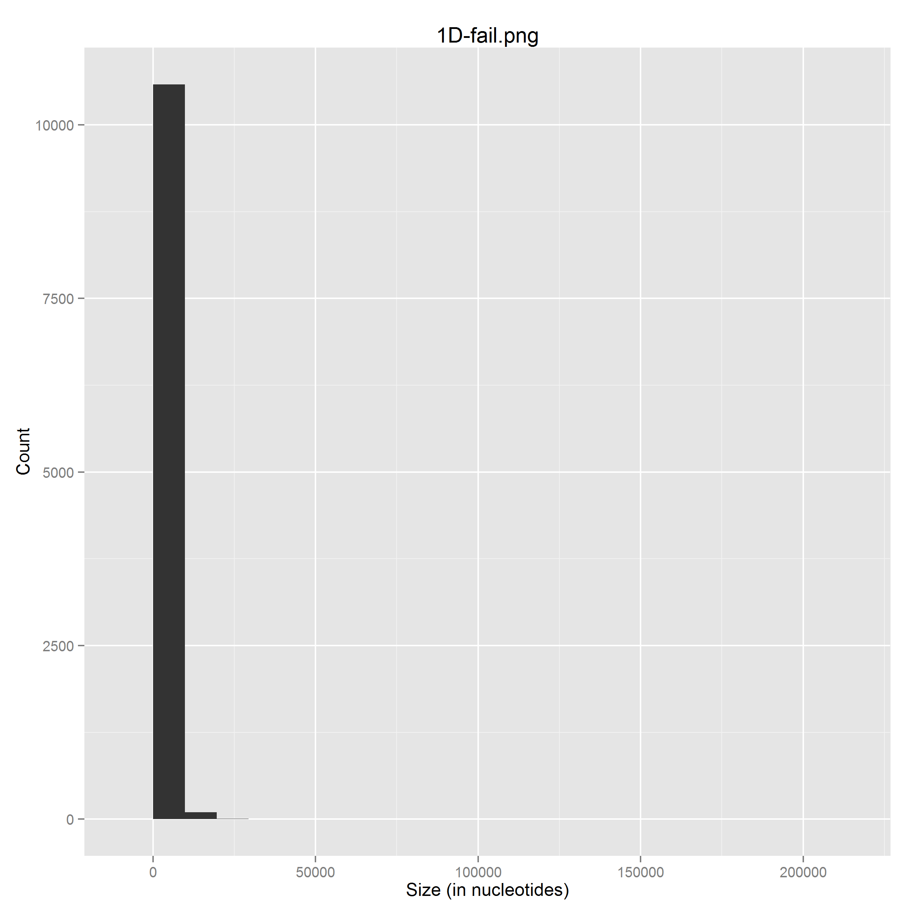
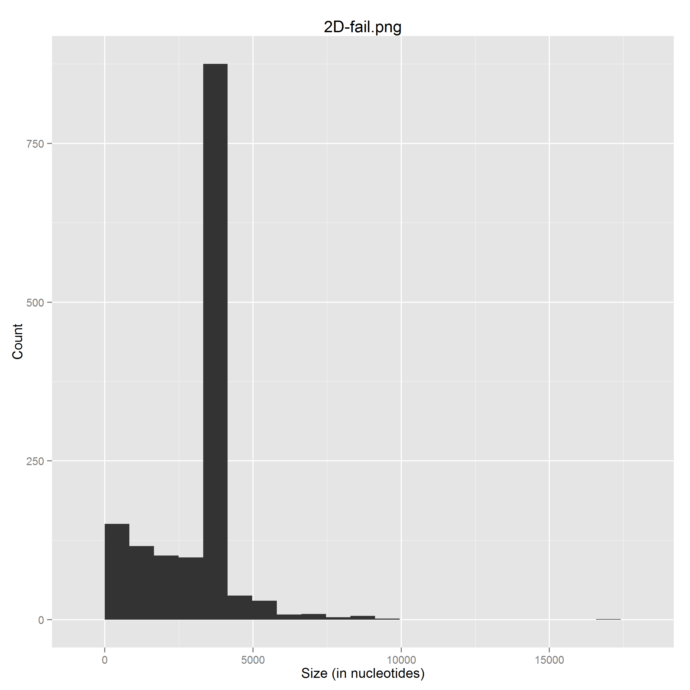
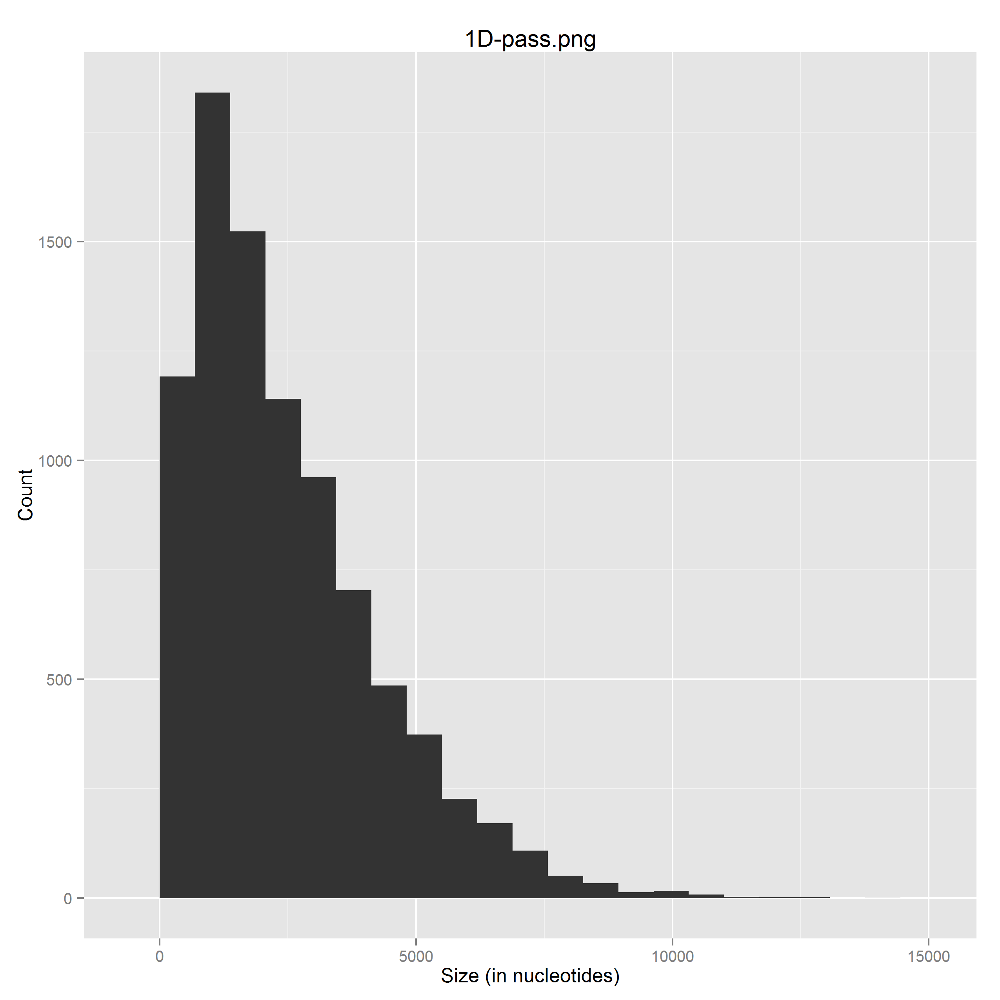
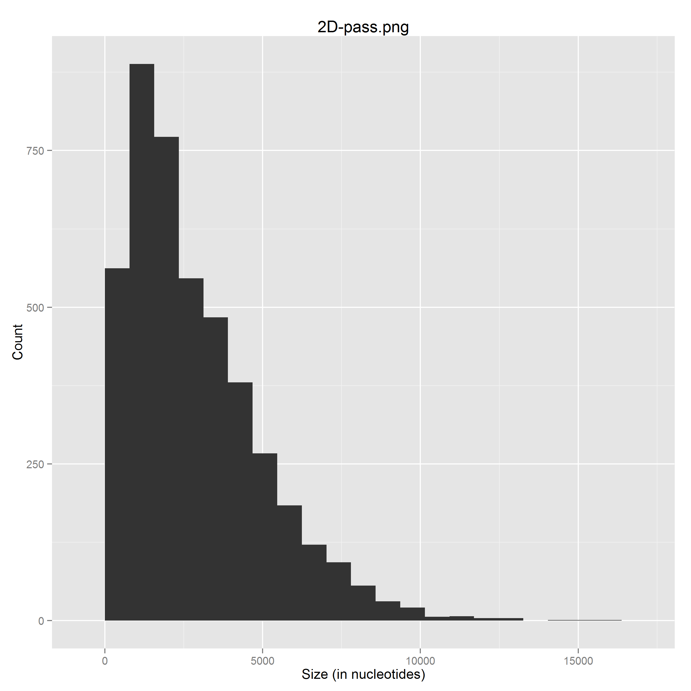

#Assignment 1
##Quality Assessment MinION reads
1. TODO

2. Active Channels =  251.0

   Average reads per channel =  101.25498008

   Channel 90 has most reads with 449 reads
   
   `$ python group5_report1_question2.py fastq/2D-fail.fastq fastq/2D-pass.fastq fastq/1D-fail.fastq fastq/1D-pass.fastq`

3. TODO

4. TODO

5. TODO

6. 
   **Length distribution of 1D (template and complement) reads, failed**

   `$ python group5_report1_question6.py fastq/1D-fail.fastq 1D-fail.png`
   
   

   _Note:_ Longest nucleotide for 1D-fail.fastq is 195979 nucleotides
   
   **Length distribution of 2D reads, failed**
   
   `$ python group5_report1_question6.py fastq/2D-fail.fastq 2D-fail.png`
   
   
   
   **Length distribution of 1D (template and complement) reads, passed**
   
   `$ python group5_report1_question6.py fastq/1D-pass.fastq 1D-pass.png`
   
   
   
   **Length distribution of 2D reads, passed**
   
   `$ python group5_report1_question6.py fastq/2D-pass.fastq 2D-pass.png`
   
   
   
7. Longest read obtained for:

   | Passed reads | Nucleotides |
   | --- | --- | 
   | Template |13927 |
   | Complement | 13927 |
   | 2D | 15808 |
   
   `$ python group5_report1_question7.py fastq/template-pass.fastq`
   
   `$ python group5_report1_question7.py fastq/complement-pass.fastq`
   
   `$ python group5_report1_question7.py fastq/2D-pass.fastq`
   
8. TODO

9. TODO

10. Nucleotide composition of both 2D sequences that classified as 'passed' and as 'failed'

   | Nucleotide  | Nucleotide Count | Total Nucleotides | Percentage |
   | --- | --- | --- | --- |
   | A  | 4607015  | 17231796 | 26.7355474728% |
   | C  | 3982240  | 17231796 | 23.109837187% |
   | T  | 4587590  | 17231796 | 26.6228198152% |
   | G  | 4054951  | 17231796 | 23.531795525% |
   
   `$ python group5_report1_question10.py fastq/2D-fail.fastq fastq/2D-pass.fastq`

11. TODO
