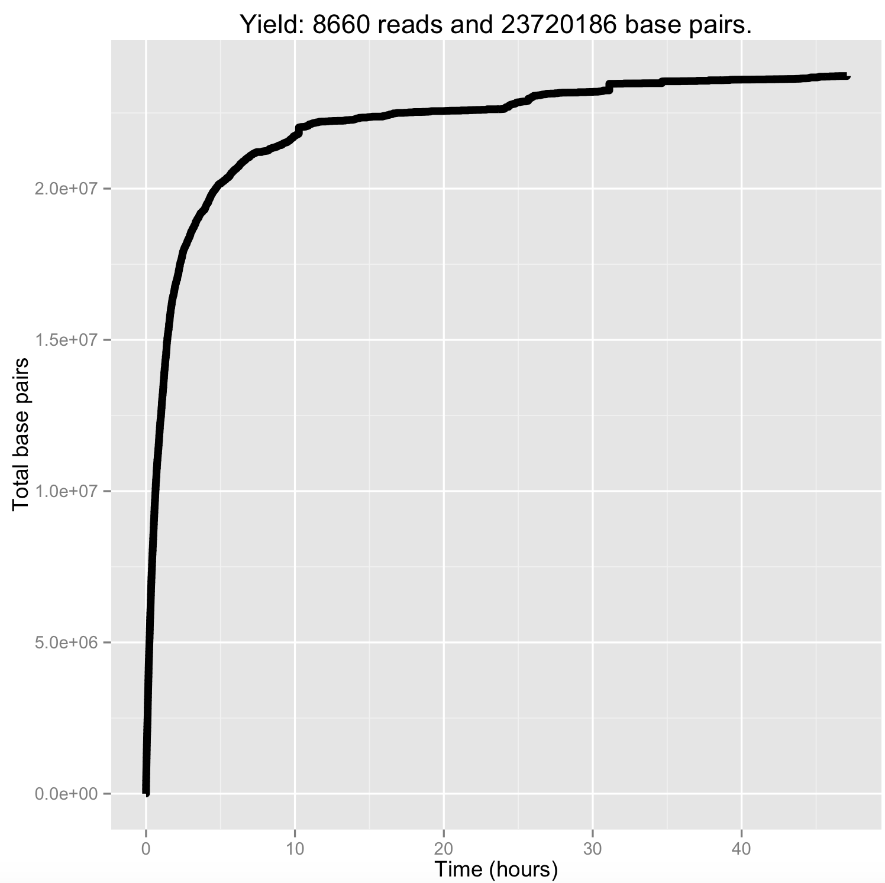

#Assignment 1
##Quality Assessment MinION reads
1. TODO

2. Active Channels =  251.0

   Average reads per channel =  101.25498008

   Channel 90 has most reads with 449 reads
   
   `$ python group5_report1_question2.py fastq/2D-fail.fastq fastq/2D-pass.fastq fastq/1D-fail.fastq fastq/1D-pass.fastq`

3. Plot Cummulative Distribution of Nucleotides over Time (hours)
   **Cummulative Distribution of Nucleotide reads, passed**
   `$ poretools yield_plot --plot-type basepairs pass`

   

   **Cummulative Distribution of Nucleotide reads, passed**
   `$ poretools yield_plot --plot-type basepairs pass`

   

4. Our point of diminishing return seemed to be at hour five, where we had 20,000,000 base pairs sequenced. If we extrapolate, we would be able to sequence 3.2 billion base pairs in 800 hours.

   It's important that this is based off of reads that passed the quality filter.
   
   If we account for failed reads as well (of which many were ignored due to no start time), we are reading at roughly twice the rate, so we would be able to read 3.2 billion base pairs in 400 hours.

5. Using `poretools qualdist`, we can see the quality of reads and calculate the mean/standard deviation, which is 10.57 and 1.656 respectively (using Excel).

   We can use the date modified rates (and verify by looking at the times of the reads) and use `poretools qualdist` on these separate data sets. From that, we get that the median is 10, 9 respectively.
   
   For the student t-test, (using 2-tailed, unpaired and unequal variance), we get p = 0.0782594968, implying we can't quite reject the null hypothesis that the distributions of the quality of reads between the first and last hour are different. 

6. 
   **Length distribution of 1D (template and complement) reads, failed**

   `$ python group5_report1_question6.py fastq/1D-fail.fastq 1D-fail.png`
   
   

   _Note:_ Longest nucleotide for 1D-fail.fastq is 195979 nucleotides
   
   **Length distribution of 2D reads, failed**
   
   `$ python group5_report1_question6.py fastq/2D-fail.fastq 2D-fail.png`
   
   
   
   **Length distribution of 1D (template and complement) reads, passed**
   
   `$ python group5_report1_question6.py fastq/1D-pass.fastq 1D-pass.png`
   
   
   
   **Length distribution of 2D reads, passed**
   
   `$ python group5_report1_question6.py fastq/2D-pass.fastq 2D-pass.png`
   
   
   
7. Longest read obtained for:

   | Passed reads | Nucleotides |
   | --- | --- | 
   | Template |13927 |
   | Complement | 13927 |
   | 2D | 15808 |
   
   `$ python group5_report1_question7.py fastq/template-pass.fastq`
   
   `$ python group5_report1_question7.py fastq/complement-pass.fastq`
   
   `$ python group5_report1_question7.py fastq/2D-pass.fastq`
   
8. Sequence Length and DNA timing Correlation

   There is not a strong correlation between the sequence length and timing of a DNA strand passing through the pore (R^2 = 0.0599966384681). However, because the timing of the read sequences is strongly skewed to the right with most of the reads being sequenced earlier in the run, most of the longer sequences occurred earlier in the run. 
   
   

9. Sequence Length and Duration in Pore Correlation - Pass & Fail:
   
   **Length versus Duration in Pore, failed**
      
   ***R^2 = 0.389877842988***

   **Length versus Duration in Pore, passed**
   
   ***R^2 = 0.778978724524***

10. Nucleotide composition of both 2D sequences that classified as 'passed' and as 'failed'

   | Nucleotide  | Nucleotide Count | Total Nucleotides | Percentage |
   | --- | --- | --- | --- |
   | A  | 4607015  | 17231796 | 26.7355474728% |
   | C  | 3982240  | 17231796 | 23.109837187% |
   | T  | 4587590  | 17231796 | 26.6228198152% |
   | G  | 4054951  | 17231796 | 23.531795525% |
   
   `$ python group5_report1_question10.py fastq/2D-fail.fastq fastq/2D-pass.fastq`

11. Linear regression was performed on k-mer count features of sequences and sequencing time durations.

Several k-mer lenghts were considered.  Initially we thought to use 5-mers, which would give us a 1024 dimensional feature space, however, since the data is fairly noisy and we only fit to about 4000 data points, this first model overfit.

To pick the ideal kmer length, we performed five-fold cross-validation, and found that k-mers of length 3 gave the best results.

To run, provide the path to a tsv containing sequences and labels and the kmer length as arguments:
    `$python group5_report1_question11.py data/seq_times.tsv 3`

The mean and variance of the R2 values and across the 5 folds is provided.

The data points are shuffled to prevent any biases present in the order of the
data points.

###Train set performance:
* Mean R2: 0.671546 
* Var R2: 0.001106

###Test set performance:
* Mean R2: 0.649408
* Var R2: 0.010450
